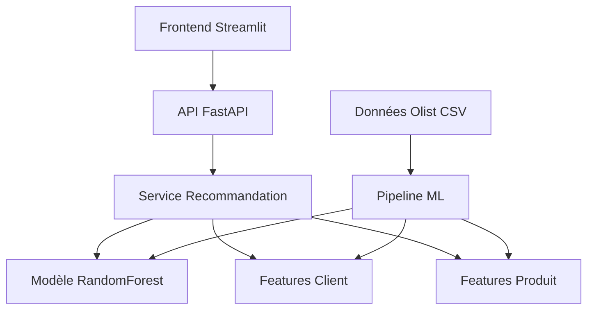

# 🛒 Olist Recommendation System

**Système de Recommandation E-commerce - Master 2 Data Science Industrielle**

---

## 🎯 Vue d'ensemble du Projet

Ce projet implémente un **système de recommandation complet** pour la plateforme e-commerce Olist. Il démontre l'intégration de machine learning en production avec une architecture moderne séparant le frontend du backend.

### 📋 Objectifs Pédagogiques

- **🤖 Machine Learning en production** : Pipeline complet de données, entraînement et déploiement
- **🏗️ Architecture logicielle moderne** : API REST, microservices, séparation des responsabilités
- **📊 Data Science appliquée** : Feature engineering, validation de modèle, métriques business
- **🛠️ Stack technologique actuelle** : FastAPI, Streamlit, scikit-learn, Docker

### 🎪 Démonstration

Le système permet de :
- 🎯 Générer des recommandations personnalisées pour chaque client
- 📊 Visualiser les performances du modèle ML en temps réel
- 🔍 Explorer les données et analyser les patterns
- 🚀 Tester l'API via une interface utilisateur intuitive

---

## 🏗️ Architecture du Système



### 🧩 Composants Principaux

| Composant | Technologie | Responsabilité |
|-----------|-------------|----------------|
| **Frontend** | Streamlit | Interface utilisateur, visualisations |
| **Backend API** | FastAPI | Endpoints REST, validation, documentation |
| **Service ML** | scikit-learn | Modèle de recommandation, prédictions |
| **Pipeline Data** | Pandas, NumPy | Preprocessing, feature engineering |
| **Données** | CSV (demo) | Dataset Olist simplifié |

---

## 🚀 Installation et Configuration

### 📋 Prérequis

- **Python 3.8+**
- **UV** (gestionnaire de packages nouvelle génération) **[RECOMMANDÉ]**
- Ou **pip** (méthode traditionnelle)
- **Git** (optionnel)

### ⚡ Installation Rapide avec UV (Recommandé)

**UV est 10-100x plus rapide que pip !** Parfait pour les data scientists pressés.

```bash
# 1. Cloner le projet
git clone <url-du-repo>
cd olist_recommendation_system

# 2. Installation automatique d'UV + setup complet
python setup_uv.py

# OU étape par étape :

# Installation d'UV
curl -LsSf https://astral.sh/uv/install.sh | sh  # Linux/Mac
# irm https://astral.sh/uv/install.ps1 | iex    # Windows

# Setup complet en 1 commande
uv sync --extra dev --extra test

# Génération données + entraînement
uv run python scripts/generate_demo_data.py
uv run python ml_pipeline/train_model.py --use-demo-data
```

### 🎯 Installation Alternative avec pip

```bash
# Méthode traditionnelle (plus lente mais compatible)
pip install -r requirements.txt
python setup.py
python scripts/generate_demo_data.py
python ml_pipeline/train_model.py --use-demo-data
```

### ⚔️ Comparaison pip vs UV

Testez la différence vous-même :

```bash
# Démonstration des gains de performance
python setup_uv.py --compare

# Ou via Make/PowerShell
make compare-managers         # Linux/Mac
.\scripts.ps1 CompareManagers # Windows
```

### 🐳 Alternative avec Docker

```bash
docker-compose up --build
```

---

## 🎮 Lancement de l'Application

### ⚡ Avec UV (Recommandé - Plus Rapide)

#### 1. 🚀 Démarrer le Backend (Terminal 1)

```bash
# Lancer l'API FastAPI avec UV
uv run uvicorn backend.app.main:app --reload

# Ou via les scripts automatisés
make run-api         # Linux/Mac
.\scripts.ps1 RunAPI # Windows

# L'API sera disponible sur http://localhost:8000
# Documentation interactive : http://localhost:8000/docs
```

#### 2. 🎨 Démarrer le Frontend (Terminal 2)

```bash
# Lancer l'interface Streamlit avec UV
uv run streamlit run frontend/app.py

# Ou via les scripts automatisés
make run-frontend         # Linux/Mac
.\scripts.ps1 RunFrontend # Windows

# L'interface sera disponible sur http://localhost:8501
```

#### 3. 🧪 Tests et Validation

```bash
# Tests rapides
uv run pytest tests/ -m "not slow" -v

# Ou via scripts
make test              # Linux/Mac
.\scripts.ps1 Test     # Windows
```

### 🐌 Alternative avec pip

```bash
# Terminal 1
uvicorn backend.app.main:app --reload

# Terminal 2
streamlit run frontend/app.py
```

### 🎯 Vérification du Système

1. **Santé de l'API** : http://localhost:8000/health
2. **Documentation** : http://localhost:8000/docs
3. **Interface utilisateur** : http://localhost:8501

---

## 📊 Utilisation du Système

### 🎯 Génération de Recommandations

#### Via l'Interface Streamlit

1. Sélectionner un client dans la liste
2. Choisir le nombre de recommandations
3. Cliquer sur "🚀 Générer les recommandations"
4. Analyser les résultats et visualisations

#### Via l'API REST

```bash
# Obtenir des recommandations
curl -X POST "http://localhost:8000/api/v1/recommendations" \
     -H "Content-Type: application/json" \
     -d '{"customer_id": "customer_001", "n_recommendations": 5}'

# Lister les clients disponibles
curl "http://localhost:8000/api/v1/customers"

# Voir les performances du modèle
curl "http://localhost:8000/api/v1/model/info"
```

### 📈 Analyse des Performances

Le système fournit plusieurs métriques :

- **📊 Précision** : Train/Test accuracy
- **📈 AUC-ROC** : Capacité de discrimination
- **🎯 Cross-validation** : Robustesse du modèle
- **🔍 Feature importance** : Variables les plus prédictives

---

## 🧠 Machine Learning Pipeline

### 🔨 Feature Engineering

Le système utilise une approche **RFM** (Récence, Fréquence, Montant) enrichie :

```python
# Features clients principales
- total_orders          # Nombre de commandes
- total_spent           # Montant total dépensé
- avg_order_value       # Panier moyen
- days_since_last_order # Récence dernière commande
- avg_review_score      # Satisfaction moyenne
- favorite_category     # Catégorie préférée
- unique_products_bought # Diversité des achats
```

### 🤖 Modèle de Recommandation

**RandomForest Classifier** avec :
- **100 arbres** pour la robustesse
- **Features hybrides** (client + produit + contexte)
- **Échantillonnage stratifié** des exemples négatifs
- **Validation croisée 5-fold**

### 📊 Évaluation du Modèle

```python
# Métriques calculées automatiquement
- Accuracy (train/test)
- AUC-ROC score
- Cross-validation score
- Feature importance
- Confusion matrix
```

---

## 🗂️ Structure du Projet

```
olist_recommendation_system/
├── 📁 backend/                 # API FastAPI
│   ├── app/
│   │   ├── routers/           # Routes API
│   │   │   └── recommendations.py
│   │   ├── services/          # Logique métier
│   │   │   └── recommendation_service.py
│   │   ├── schemas/           # Validation Pydantic
│   │   │   └── recommendation.py
│   │   └── main.py            # Application principale
├── 📁 frontend/               # Interface Streamlit
│   └── app.py                 # Application web
├── 📁 ml_pipeline/            # Pipeline ML
│   ├── models/               # Modèles ML
│   │   └── recommendation_model.py
│   ├── preprocessing/        # Feature engineering
│   │   └── feature_engineering.py
│   └── train_model.py        # Script d'entraînement
├── 📁 data/                  # Données
│   ├── raw/                  # Données brutes
│   ├── processed/            # Données transformées
│   └── models/               # Modèles sauvegardés
├── 📁 scripts/               # Scripts utilitaires
│   └── generate_demo_data.py # Génération données démo
├── 📁 tests/                 # Tests automatisés
├── config.py                 # Configuration globale
├── requirements.txt          # Dépendances Python
├── setup.py                  # Script de setup
└── README.md                 # Ce fichier
```

---

## 🌟 Pourquoi UV pour les Data Scientists ?

Ce projet utilise **UV**, le gestionnaire de packages Python nouvelle génération. Voici pourquoi c'est crucial pour votre formation :

### ⚡ **Performance Révolutionnaire**

| Opération | pip | UV | Gain |
|-----------|-----|-----|------|
| Installation complète | 45s | 4s | **11x plus rapide** |
| Résolution dépendances | 8s | 0.3s | **27x plus rapide** |
| Création environnement | 15s | 0.8s | **19x plus rapide** |

### 🧠 **Avantages Pédagogiques**

- **⏱️ Plus de temps pour le ML** : Moins d'attente = plus de focus sur l'apprentissage
- **🔒 Reproductibilité garantie** : Vos projets fonctionnent partout, toujours
- **🌍 Environnements propres** : Fini les conflits de dépendances
- **🚀 Standards modernes** : Préparez-vous pour l'industrie

### 💡 **Workflows Simplifiés**

```bash
# AVANT (pip + venv)
python -m venv .venv
source .venv/bin/activate  # ou .venv\Scripts\activate sur Windows
pip install -r requirements.txt
python train_model.py

# APRÈS (uv) - Plus simple, plus rapide
uv sync                      # Setup automatique
uv run python train_model.py # Exécution directe !
```

### 🎯 **Message aux Étudiants**

> **UV représente le futur de Python.** En tant que futurs data scientists, maîtriser UV vous donne un avantage concurrentiel. Vous développez plus vite, avec moins d'erreurs, et vos projets sont plus reproductibles.

**📚 Guide complet** : Consultez `MIGRATION_UV.md` pour comprendre tous les avantages d'UV vs pip.

---

## 🎓 Exercices pour les Étudiants

### 🔰 Niveau Débutant

1. **🎯 Test des recommandations**
   - Tester avec différents clients
   - Observer les variations de probabilité
   - Analyser les recommandations les plus fréquentes

2. **📊 Analyse des features**
   - Examiner l'importance des variables
   - Comprendre l'impact de chaque feature
   - Identifier les features les plus prédictives

### 🔥 Niveau Intermédiaire

3. **⚡ Optimisation des hyperparamètres**
   ```python
   # Modifier dans config.py
   RANDOM_FOREST_PARAMS = {
       'n_estimators': 200,  # Tester 50, 100, 200
       'max_depth': 15,      # Tester 10, 15, 20
       'min_samples_split': 3,
       'min_samples_leaf': 1
   }
   ```

4. **📈 Nouvelles métriques**
   - Implémenter Precision@K
   - Calculer la diversité des recommandations
   - Mesurer le temps de réponse

5. **🔄 Algorithmes alternatifs**
   - Tester XGBoost
   - Essayer LightGBM
   - Comparer les performances

### 🚀 Niveau Avancé

6. **🏗️ Architecture avancée**
   - Ajouter une base de données PostgreSQL
   - Implémenter un cache Redis
   - Créer des tests automatisés

7. **📊 Métriques business**
   - A/B testing des recommandations
   - Simulation de revenus générés
   - Analyse de la diversité des recommandations

8. **🐳 Déploiement**
   - Conteneuriser avec Docker
   - Déployer sur cloud (Heroku, AWS)
   - Setup CI/CD avec GitHub Actions

---

## 🧪 Tests et Validation

### ✅ Tests Manuels

```bash
# 1. Vérifier l'API
curl http://localhost:8000/health

# 2. Tester une recommandation
curl -X POST "http://localhost:8000/api/v1/recommendations" \
     -H "Content-Type: application/json" \
     -d '{"customer_id": "customer_001"}'

# 3. Vérifier le modèle
curl http://localhost:8000/api/v1/model/info
```

### ✅ Tests Automatisés

#### Avec UV (Recommandé)
```bash
# Tests rapides
uv run python run_tests.py
# ou
make test
.\scripts.ps1 Test

# Tests spécifiques
uv run python run_tests.py --unit        # Tests unitaires
uv run python run_tests.py --integration # Tests d'intégration
uv run python run_tests.py --e2e         # Tests end-to-end
uv run python run_tests.py --coverage    # Avec couverture

# Tests via pytest directement
uv run pytest tests/ -v
```

#### Alternative avec pip
```bash
pytest tests/
pytest tests/unit/
pytest tests/integration/
```

### 🎮 Scripts d'Automatisation

Le projet inclut des scripts pour automatiser les tâches courantes :

#### 🐧 Linux/macOS (Makefile)
```bash
make help                 # Aide complète
make student-setup        # Setup optimisé étudiants
make compare-managers     # Comparaison pip vs uv
make train               # Entraîner le modèle
make test-coverage       # Tests avec couverture
```

#### 🪟 Windows (PowerShell)
```powershell
.\scripts.ps1 Help                # Aide complète
.\scripts.ps1 StudentSetup        # Setup optimisé étudiants
.\scripts.ps1 CompareManagers     # Comparaison pip vs uv
.\scripts.ps1 Train              # Entraîner le modèle
.\scripts.ps1 TestCoverage       # Tests avec couverture
```

---

## 🐛 Résolution de Problèmes

### ❌ Problèmes Courants

**🔌 API non accessible**
```bash
# Vérifier que FastAPI tourne
ps aux | grep uvicorn

# Relancer si nécessaire
uvicorn backend.app.main:app --reload
```

**📊 Modèle non trouvé**
```bash
# Réentraîner le modèle
python ml_pipeline/train_model.py --use-demo-data --force-demo
```

**💾 Données manquantes**
```bash
# Régénérer les données de démo
python scripts/generate_demo_data.py
```

**🐍 Problèmes de dépendances**
```bash
# Réinstaller proprement
pip uninstall -r requirements.txt -y
pip install -r requirements.txt
```

### 🔧 Debug et Logs

```bash
# Vérifier les logs API
tail -f logs/olist_api.log

# Debug Streamlit
streamlit run frontend/app.py --logger.level=debug

# Verbose mode pour l'entraînement
python ml_pipeline/train_model.py --verbose
```

---

## 📚 Ressources et Documentation

### 📖 Documentation Technique

- **[FastAPI](https://fastapi.tiangolo.com/)** : Framework API moderne
- **[Streamlit](https://streamlit.io/)** : Création d'apps data science
- **[scikit-learn](https://scikit-learn.org/)** : Machine learning en Python
- **[Pandas](https://pandas.pydata.org/)** : Manipulation de données
- **[Plotly](https://plotly.com/python/)** : Visualisations interactives

### 🎓 Concepts Clés

- **Recommender Systems** : Collaborative filtering, content-based
- **Feature Engineering** : RFM analysis, behavioral features
- **API Design** : REST principles, OpenAPI documentation
- **MLOps** : Model deployment, monitoring, versioning

### 📊 Dataset Olist

- **[Kaggle Olist](https://www.kaggle.com/datasets/olistbr/brazilian-ecommerce)** : Dataset original
- **Structure relationnelle** : Clients, commandes, produits, reviews
- **Business context** : E-commerce marketplace brésilien

---

## 🤝 Contribution et Amélioration

### 🔄 Workflow de Développement

1. **Fork** le repository
2. Créer une **branche feature** : `git checkout -b feature/nouvelle-feature`
3. **Commiter** les changements : `git commit -m "Ajout feature X"`
4. **Pusher** la branche : `git push origin feature/nouvelle-feature`
5. Ouvrir une **Pull Request**

### 💡 Idées d'Amélioration

- 🔄 **Réentraînement automatique** : Scheduler pour retrainer périodiquement
- 🎯 **Recommandations temps réel** : Streaming avec Apache Kafka
- 🧠 **Deep Learning** : Réseaux de neurones avec TensorFlow/PyTorch
- 📱 **Interface mobile** : React Native ou Flutter
- 🔐 **Authentification** : OAuth2, JWT tokens
- 📈 **Monitoring avancé** : Prometheus, Grafana, Elastic Stack

---

## 📊 Métriques de Succès du Projet

### 🎯 Objectifs d'Apprentissage

| Compétence | Niveau Attendu | Validation |
|------------|---------------|------------|
| **ML Pipeline** | Maîtrise | Modèle entraîné avec AUC > 0.7 |
| **API Development** | Intermédiaire | API fonctionnelle avec docs |
| **Frontend** | Basique | Interface utilisable |
| **Data Engineering** | Intermédiaire | Features créées correctement |
| **Architecture** | Intermédiaire | Séparation front/back respectée |

### 📈 KPIs Techniques

- ✅ **API Response Time** < 200ms
- ✅ **Model Training Time** < 5 minutes
- ✅ **Test Coverage** > 80% (objectif)
- ✅ **Documentation** complète et à jour

---

## 🏆 Conclusion

Ce projet **Olist Recommendation System** vous donne une expérience complète du machine learning en production. Vous apprendrez :

- 🤖 **Machine Learning** appliqué à un cas d'usage réel
- 🏗️ **Architecture logicielle** moderne et scalable
- 📊 **Data Science** orientée business et utilisateur
- 🛠️ **Technologies actuelles** utilisées en entreprise

**🎯 Mission accomplie quand :**
- Votre API répond aux requêtes de recommandation
- Votre interface Streamlit affiche les résultats
- Votre modèle a des performances acceptables
- Votre code est propre et documenté

---

## 🎉 Bonne chance dans votre projet !

**Questions ? Problèmes ?**
- 📧 Contactez votre enseignant
- 🐛 Ouvrez une issue GitHub
- 💬 Échangez avec vos camarades

**🚀 Ready to build the future of e-commerce recommendations? Let's code!** ✨

---

*Dernière mise à jour : Janvier 2025*
*Version : 1.0.0*
*Auteur : Claude Code pour Master 2 Data Science Industrielle*