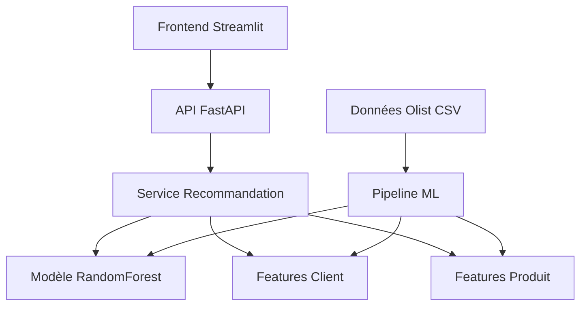

# **SolIA**

Jourdan Idriss, Sabashvili Rezi, Thai Kim et Grilo Cassandre  
Sous la direction de : Mohamed TRIBAK

**Live Demo** : [Solia - Votre solution de la solvabilité](https://soliasep2426.streamlit.app/)

# 1. Le Concept : Le Pivot SolIA  
L’objectif est passé d’un système de recommandation B2C (recommander des produits) à un système de __Credit Scoring B2B__. Nous analysons la santé financière d’un vendeur Olist pour déterminer son __éligibilité à un prêt bancaire__.  

# 2. Architecture des Données  
Le moteur traite __6 bases de données__ (_Orders_, _Items_, _Payments_, _Reviews_, _Products_, _Sellers_). Contrairement au projet initial, nous agrégeons tout par `seller_id` pour obtenir des indicateurs de performance commerciale et logistique.  

# 3. Le Score de Solvabilité (La Formule)  
Pour évaluer le risque, nous avons créé un score hybride sur __100 points__ basé sur trois piliers :  
* __Performance (40%)__ : Volume d’affaires total (CA).  
* __Satisfaction (30%)__ : Note moyenne des avis clients.  
* __Fiabilité (30%)__ : Maîtrise des délais (inverse du taux de retard). 

__Calcul du score__ : *Score = (Norm_CA × 40) + (Norm_Sat × 30) + (Norm_Logistique × 30)*

# 4. Le Modèle Prédictif  
Nous utilisons un Random Forest Regressor. Au lieu de prédire une catégorie, il prédit une valeur monétaire : le Chiffre d’Affaires futur.    
* __Variables d’entrée__ (*X*) : Note moyenne, taux de retard, mensualités moyennes, an- cienneté, score de solvabilité.  
* __Variable cible__ (*y*) : Revenu total.  
* __Performance__ : Fiabilité (R2) de __95%__ et erreur moyenne (MAE) de __1779 R$__.  

# 5. L’Outil de Décision (Dashboard Streamlit)  
L’interface permet de simuler une demande de prêt en temps réel :  
* __Verdict visuel__ : Vert (éligible), Orange (à étudier), Rouge (refusé).  
* __Capacité de remboursement__ : Calcul automatique d’une __mensualité maximale__
plafonnée à __30% du CA prédit__ par l’IA.  

## Architecture du Système



### Composants Principaux

| Composant | Technologie | Responsabilité |
|-----------|-------------|----------------|
| **Frontend** | Streamlit | Interface utilisateur, visualisations |
| **Backend API** | FastAPI | Endpoints REST, validation, documentation |
| **Service ML** | scikit-learn | Modèle de recommandation, prédictions |
| **Pipeline Data** | Pandas, NumPy | Preprocessing, feature engineering |
| **Données** | CSV (demo) | Dataset Olist simplifié |

---

## Installation et Configuration

### Prérequis

- **Python 3.8+**
- **UV** (gestionnaire de packages nouvelle génération) **[RECOMMANDÉ]**
- Ou **pip** (méthode traditionnelle)
- **Git** (optionnel)

### ⚡ Installation Rapide avec UV (Recommandé)

**UV est 10-100x plus rapide que pip !** Parfait pour les data scientists pressés.

```bash
# 1. Cloner le projet
git clone https://github.com/Drecassan/solia.git
cd SolIA

# Installation d'UV
pip install uv 

# Setup complet
uv sync 

# Génération données + entraînement
uv run python setup.py
uv run python ml_pipeline/train_model.py
```

### Installation Alternative avec pip

```bash
# Méthode traditionnelle (plus lente mais compatible)
pip install -r requirements.txt
python setup.py
python ml_pipeline/train_model.py
```

## Lancement de l'Application

### Avec UV (Recommandé - Plus Rapide)

#### 1. Démarrer le Backend (Terminal 1)

```bash
# Lancer l'API FastAPI avec UV
uv run uvicorn backend.app.main:app --reload

# L'API sera disponible sur http://localhost:8000
# Documentation interactive : http://localhost:8000/docs
```

#### 2. Démarrer le Frontend (Terminal 2)

```bash
# Lancer l'interface Streamlit avec UV
uv run streamlit run frontend/app.py

# L'interface sera disponible sur http://localhost:8501
```

#### 3. Tests et Validation

```bash
# Tests rapides
uv run pytest tests/ -m "not slow" -v
```


### Vérification du Système

1. **Santé de l'API** : http://localhost:8000/health
2. **Documentation** : http://localhost:8000/docs
3. **Interface utilisateur** : http://localhost:8501

---


---
## Structure du Projet

```
olist_recommendation_system/
├── 📁 backend/                 # API FastAPI
│   ├── app/
│   │   ├── routers/           # Routes API
│   │   │   └── recommendations.py
│   │   ├── services/          # Logique métier
│   │   │   └── recommendation_service.py
│   │   ├── schemas/           # Validation Pydantic
│   │   │   └── recommendation.py
│   │   └── main.py            # Application principale
├── 📁 frontend/               # Interface Streamlit
│   └── app.py                 # Application web
├── 📁 ml_pipeline/            # Pipeline ML
│   ├── models/               # Modèles ML
│   │   └── recommendation_model.py
│   ├── preprocessing/        # Feature engineering
│   │   └── feature_engineering.py
│   └── train_model.py        # Script d'entraînement
├── 📁 data/                  # Données
│   ├── raw/                  # Données brutes
│   ├── processed/            # Données transformées
│   └── models/               # Modèles sauvegardés
├── 📁 scripts/               # Scripts utilitaires
│   └── generate_demo_data.py # Génération données démo
├── 📁 tests/                 # Tests automatisés
├── config.py                 # Configuration globale
├── requirements.txt          # Dépendances Python
├── setup.py                  # Script de setup
└── README.md                 # Ce fichier
```


## Tests et Validation

### Tests Manuels

```bash
# 1. Vérifier l'API
curl http://localhost:8000/health

# 2. Tester une recommandation
curl -X POST "http://localhost:8000/api/v1/recommendations" \
     -H "Content-Type: application/json" \
     -d '{"customer_id": "customer_001"}'

# 3. Vérifier le modèle
curl http://localhost:8000/api/v1/model/info
```

### Tests Automatisés

#### Avec UV
```bash
# Tests via pytest 
uv run pytest tests/ -v
```

---

## Ressources et Documentation

### Documentation Technique

- **[FastAPI](https://fastapi.tiangolo.com/)** : Framework API moderne
- **[Streamlit](https://streamlit.io/)** : Création d'apps data science
- **[scikit-learn](https://scikit-learn.org/)** : Machine learning en Python
- **[Pandas](https://pandas.pydata.org/)** : Manipulation de données
- **[Plotly](https://plotly.com/python/)** : Visualisations interactives

### Concepts Clés

- **Recommender Systems** : Collaborative filtering, content-based
- **Feature Engineering** : RFM analysis, behavioral features
- **API Design** : REST principles, OpenAPI documentation
- **MLOps** : Model deployment, monitoring, versioning

### Dataset Olist

- **[Kaggle Olist](https://www.kaggle.com/datasets/olistbr/brazilian-ecommerce)** : Dataset original
- **Structure relationnelle** : Clients, commandes, produits, reviews
- **Business context** : E-commerce marketplace brésilien

---
